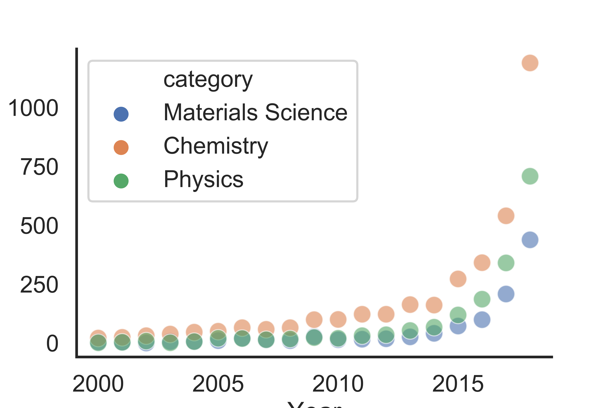

# Charting ML Publications in Science

As machine learning has grown in popularity and domain of applicability, charts showing the growth have popped up in review articles, presentations, and more.
Since many of these charts seem to have different numbers (though showing the same trend!), and  often without provenance. Thus, this repository was made to act as a resource for those looking to dig into the numbers further, or to simply find a chart for their own usage. 

# The Charts

## The Domains
* Materials Science
* Chemistry
* Physics

## Methodology
* Web of Science topic matching and 

## TODO (Pull requests welcome)
* Automate data pull through Web of Science API
* Consider a Google Scholar implementation
* Improve plot consistency and styling
* Add statistics for other domains
* Update for 2019 when full data are available

## Cite

