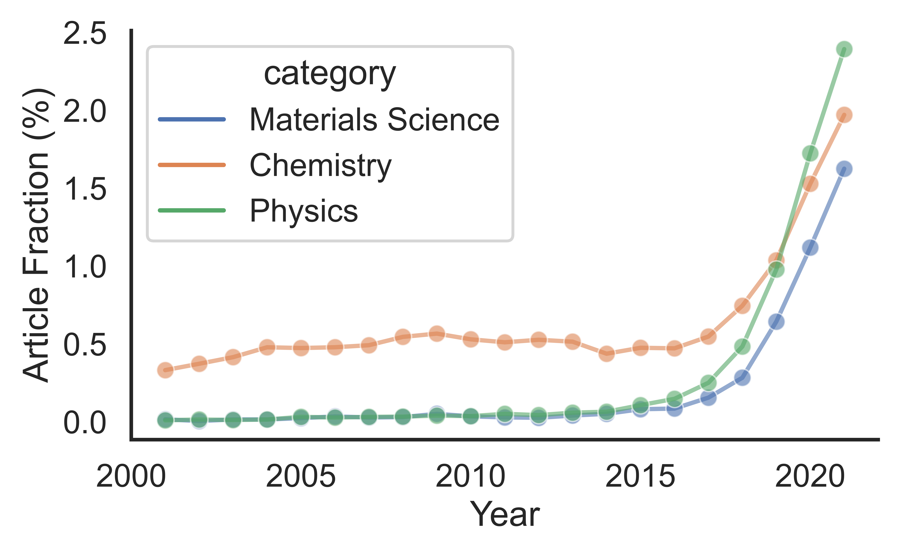
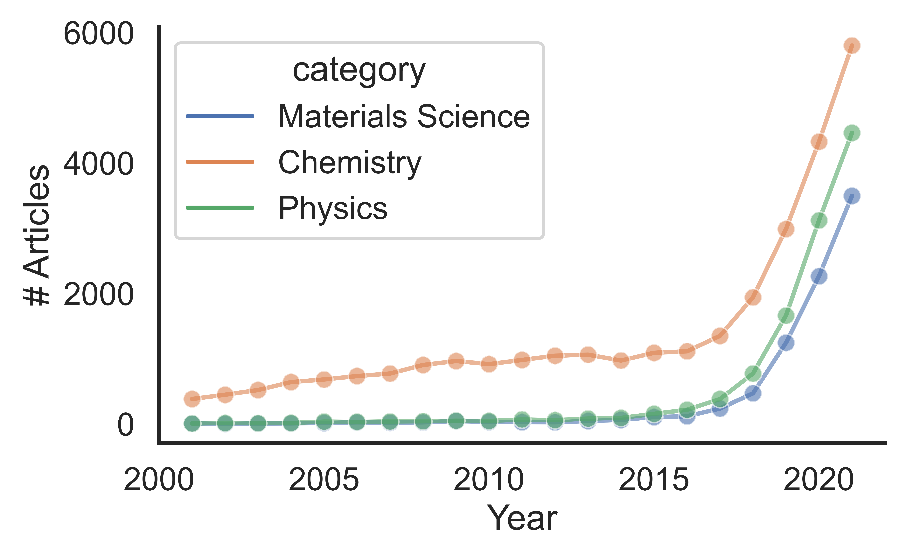
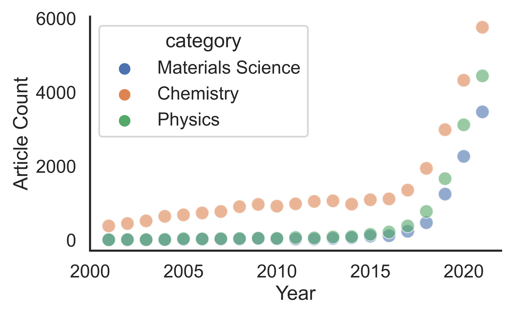

# Charting ML Publications in Science

As machine learning has grown in popularity and domain of applicability, charts showing the growth have popped up in review articles, presentations, and more.
Many of these charts seem to have different numbers (though showing the same trend!), and are often without provenance. Thus, this repository was made to act as a resource for those looking to dig into the numbers further, to quickly customize our existing plots, or to simply find a ready-made chart for their own usage. 

# 2021 Results
Table showing the count and Compound Annual Growth Rate (CAGR) on the raw number of articles published over different periods for each domain. CAGR-N represents the CAGR over N years. 

| Domain            | year | count | CAGR-1 (%) | CAGR-2 (%) | CAGR-5 (%) |
|-------------------|------|-------|------------|------------|------------|
| Materials Science | 2021 | 3471  | 54.4       | 67.5       | 96.6       |
| Chemistry         | 2021 | 4211  | 34.1       | 39.3       | 39.1       |
| Physics           | 2021 | 4445  | 43.0       | 63.8       | 82.7       |

# The Charts
Note that the charts come in two forms, normalized and count. Normalized plots take into account the relative size of the domain of interest (i.e., the number of matching articles / the total number of articles in a domain).

## Normalized Line Plot


## Raw Count Line Plot



## Scatter Plots




## The Domains
* Materials Science
* Chemistry
* Physics


## Methodology
* Web of Science topic matching and matching of domain. Exact queries are provided in the data directory.

| ID      | Service |Query |
| ----------- |----| ----------- |
| 1           |Web of Science| TS=("machine learning" OR "informatics" OR "deep learning" OR "cheminformatics" OR "chemoinformatics" OR "QSAR" OR "QSPR") AND WC="{Domain}"  |


## Customization
* All routines to create the plots are provided in the repo notebooks. 
* Customize the figure closest to your heart, and it will be saved out to the output directory.
* Don't like the queries used? Simply output your data to the same format used in /data/1.csv and re-use the plotting tools.

## TODO (Pull requests welcome)
* Automate data pull through Web of Science API
* Consider a Google Scholar implementation
* Improve plot consistency and styling
* Add statistics for other domains
* Consider adding other common plots
* Fix plots now that there are more domains in the data

## Cite
Ben Blaiszik, “2021 AI/ML Publication Statistics and Charts”. Zenodo, Sep. 07, 2022. doi: 10.5281/zenodo.7057437.

```
@software{ben_blaiszik_2022_7057437,
  author       = {Ben Blaiszik},
  title        = {2021 AI/ML Publication Statistics and Charts},
  month        = sep,
  year         = 2022,
  publisher    = {Zenodo},
  version      = {2022.09},
  doi          = {10.5281/zenodo.7057437},
  url          = {https://doi.org/10.5281/zenodo.7057437}
}
```
